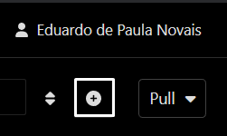
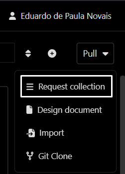
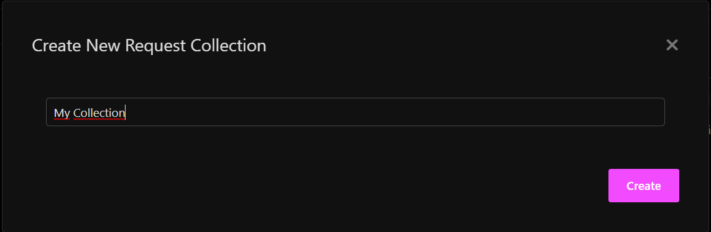
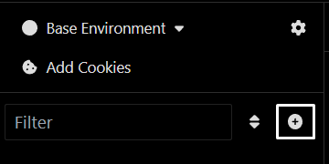
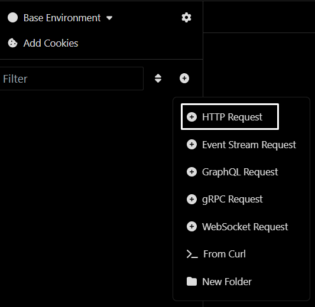
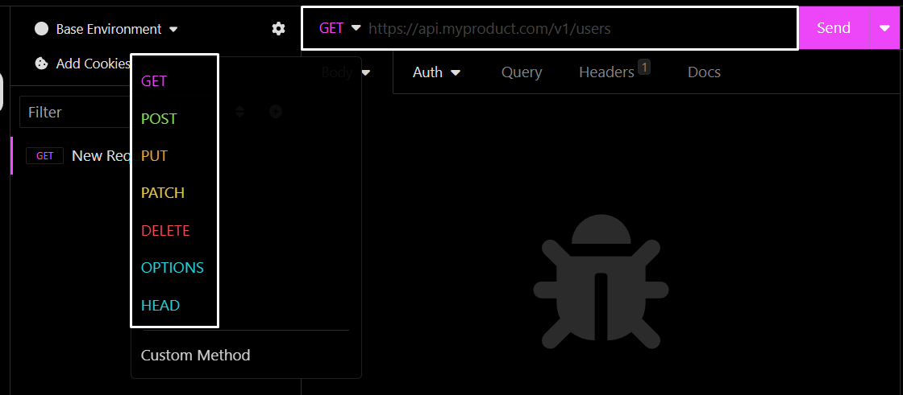

# Dindin

## Como Usar

1. Clone o Repositório
   * Clone este repositório para o seu computador usando o seguinte comando:
     ```bash
     $ git clone git@github.com:novvais/dindin.git

2. Encontre o Diretorio
   * Encontre o diretorio usando o código abaixo:
     ```bash
     $ cd didin
     
3. Baixe todas as Dependecias do Projeto
   * No terminal utilize o código abaixo para baixar todas as bibliotecas:
     ```bash
     $ npm i

4. Inicie o Servidor
   * Inicie o servidor usando o código:
     ```bash
     $ npm run dev

5. Para executar as rotas utilize o Insomnia ou um programa similiar
   * Baixe e instale o Insomnia acessando o link: https://insomnia.rest/download
   * Crie uma conta e se conecte no aplicativo

## Como Usar o Insomnia

1. Na página incial do Insomnia, clique no ícone de + no canto superior direito
   <div></div>

2. Clique na primeira opção
   <div></div>

3. Dê um nome para a coleção
   <div></div>

4. Clique no ícone de + para criar uma rota
   <div></div> 

5. Clique na primeira opção
   <div></div>

6. Escolha o verbo da rota
   * Adicione o domínio e o caminho da API
     ```bash
     http://localhost:3000
   <div></div>