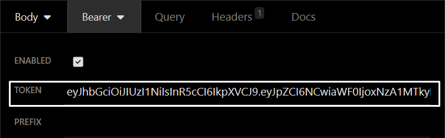

# Dindin
---

Seja bem vindo(a)!

---

<details>
<summary><b>Como Usar</b></summary>

1. Clone o Repositório
   * Clone este repositório para o seu computador usando o seguinte comando:
      ```bash
      $ git clone git@github.com:novvais/dindin.git
      ```
2. Encontre o Diretorio
   * Encontre o diretorio usando o código abaixo:
      ```bash
      $ cd didin
      ```
3. Baixe todas as Dependecias do Projeto
   * No terminal utilize o código abaixo para baixar todas as bibliotecas:
      ```bash
      $ npm i
      ```
4. Inicie o Servidor
   * Inicie o servidor usando o código:
      ```bash
      $ npm run dev
      ```
5. Para executar as rotas utilize o Insomnia ou um programa similiar
   * Baixe e instale o Insomnia acessando o link: https://insomnia.rest/download
   * Crie uma conta e se conecte no aplicativo

</details>

<details>
<summary><b>Como Usar o Insomnia</b></summary>

### **Passo a Passo**

1. Na página incial do Insomnia, clique no ícone de + no canto superior direito:
   <div></div>

2. Clique na primeira opção:
   <div></div>

3. Dê um nome para a coleção:
   <div></div>

4. Clique no ícone de + para criar uma rota:
   <div></div> 

5. Clique na primeira opção:
   <div></div>

6. Escolha o verbo da rota
   * Adicione o domínio e o caminho da API:
      ```bash
      http://localhost:3000
      ```
   <div></div>

</details>

<details>
<summary><b>Como Testar as Rotas</b></summary>

<details>
<summary>Funções do Insomnia</summary>

<details>
<summary>Body</summary>

-  Para usar o Body:
   -  Clique na caixa com o nome "Body" em seguida clique na opção "JSON" como mostra a imagem abaixo:
      <div></div>

</details>

<details>
<summary>Bearer Token</summary>

-  Para usar o Bearer:
   -  Clique na caixa com o nome "Auth": 
      <div></div>
   -  Em seguida clique na opção "Bearer Token"
      <div></div>
   -  Adicione o Token gerado na rota "login" como mostra a imagem abaixo:
      <div></div>

</details>

</details>

<details>
<summary>Explicando as Rotas</summary>

1. Rota **`POST` "cadastroUsuario"** - *Obrigatório o uso do body request*
   * Adicione o dominio e o caminho da API:
      ```bash
      http://localhost:3000/usuario
      ```

   <div></div>

   * Exemplo de resposta:
   <div></div>

2. Rota **`POST` "login"** *Obrigatório o uso do body request*
   * Adicione o dominio e o caminho da API:
      ```bash
      http://localhost:3000/login
      ```
      
   * Adicione os dados do usuário no body:
   <div></div>

   * Exemplo de resposta:
   <div></div>

   **Importante: Use o Token gerado na resposta para realizar os demais testes de rota!**

3. Rota **`GET` "detalharUsuario"** - *Obrigatório o uso do Bearer Token* 
   * Adicione o dominio e o caminho da API.
      ```bash
      http://localhost:3000/usuario
      ```
      
   * Adicione o Token gerado na resposta da rota "login" para continuar o teste.
   <div></div>

   <div></div>

4. Rota **`PUT` "atualizarUsuario"** - *Obrigatório o uso do Bearer Token* 
   * Adicione o dominio e o caminho da API
      ```bash 
      http://localhost:3000/usuario
      ```

   * Adicione o Token gerado na resposta da rota "login" para continuar o teste.
   <div></div>

5. Rota **`GET` "listarCategorias"** - *Obrigatório o uso do Bearer Token*
   * Adicione o dominio e o caminho da API
      ```bash 
      http://localhost:3000/categorias
      ```

   * Adicione o Token gerado na resposta da rota "login" para continuar o teste.
   <div></div>

   <div></div>

6. Rota **`GET` "listarTransacoesDoUsuario"** - *Obrigatório o uso do Bearer Token*
   * Adicione o dominio e o caminho da API
      ```bash 
      http://localhost:3000/transacao
      ```

   * Adicione o Token gerado na resposta da rota "login" para continuar o teste.
   <div></div>

   <div></div>

7. Rota **`GET` "detalharTransacao"** *Obrigatório o uso do Bearer Token e Params*
   * Adicione o dominio e o caminho da API
      ```bash 
      http://localhost:3000/transacao/1
      ```

   * Adicione o Token gerado na resposta da rota "login" para continuar o teste.
   <div></div>

   * Adicione o id do usuário após a "/" da URL básica.
   <div></div>

8. Rota **`POST` "cadastrarTransacao"** - *Obrigatório o uso do Bearer Token e Body*
   * Adicione o dominio e o caminho da API
      ```bash 
      http://localhost:3000/transacao
      ```

   * Adicione o Token gerado na resposta da rota "login" para continuar o teste.
   <div></div>

   * Adicione as informações da transação para cadastrar no Body.
   <div></div>

8. Rota **`PUT` "atualizarTransacao"** - *Obrigatório o uso do Bearer Token, Params e Body*
   * Adicione o dominio e o caminho da API
      ```bash 
      http://localhost:3000/transacao/1
      ```

   * Adicione o Token gerado na resposta da rota "login" para continuar o teste.
   <div></div>

   * Adicione o id do usuário após a "/" da URL básica.

   * Adicione as informações da transação para atualizar no Body.
   <div></div>

9. Rota **`DELETE` "excluirTransacao"** - *Obrigatório o uso do Bearer Token e Params*
   * Adicione o dominio e o caminho da API
      ```bash 
      http://localhost:3000/transacao/1
      ```

   * Adicione o Token gerado na resposta da rota "login" para continuar o teste.
   <div></div>

   * Adicione o id do usuário que vai ser excluído após a "/" da URL básica.
   <div></div>

10. Rota **`GET` "obterExtrato"** - *Obrigatório o uso do Bearer Token e Params*
   * Adicione o dominio e o caminho da API
      ```bash 
      http://localhost:3000/transacao/extrato
      ```

   <div></div>

   * Adicione o Token gerado na resposta da rota "login" para continuar o teste.
   <div></div>

</details>

</details>

---

**Exemplo de conteúdo do Body Request:**


   * Código:

      ```javascript  
      {
	   "nome": "Foo Ba",
      "email": "foo@bar.com",
      "cpf": "00011122233",
      "data_nascimento": "15/03/2001",
      "telefone": "11999998888",
      "senha": "1234"
      }   

**Exemplo de saída:** 
   